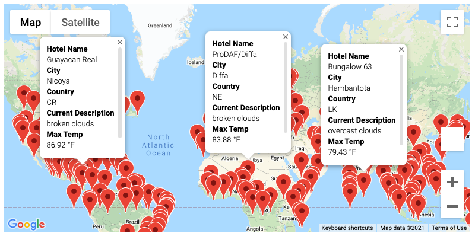
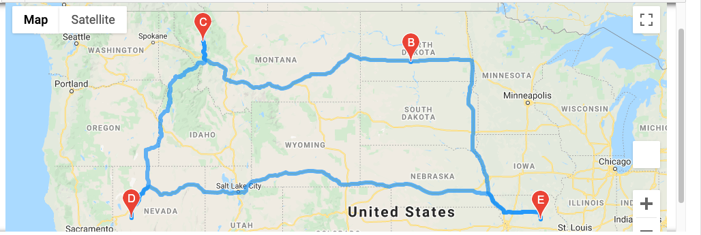
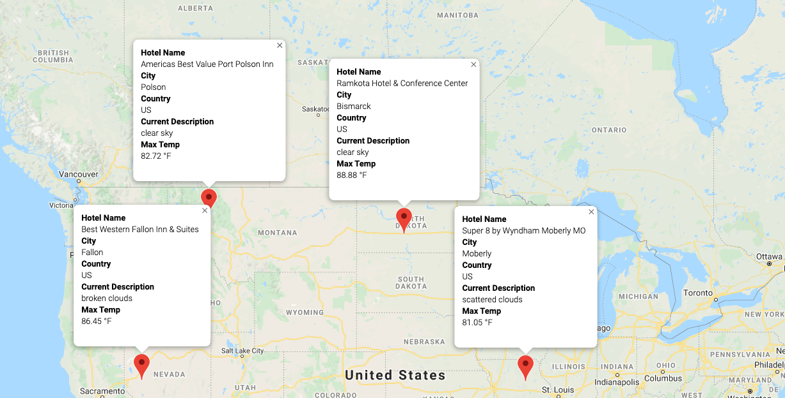

# World_Weather_Analysis

## Overview
This analysis is provided for a new application which allows the user to add weather conditions to their results as well as filter by preferred temperature ranges. This application provides:
* Configurable temperature preferences
* Details about current weather conditions in location
* Hotels available for each desired vacation location

The user chooses three locations, in addition to their home location, to build an itinerary for their road trip.

### Resources
Resources provided for this challenge:
- Vacation_Search_starter_code.ipynb
- Vacation_Itinerary_starter_code.ipynb

### Weather Data

Creating random latitudes and longitudes, the OpenWeatherMAP API was utilized to create a .csv file to hold the following information about each location:
* City
* Country
* Latitude & Longitude
* Maximum Temperature
* Humidity
* Cloudiness
* Wind Speed
* Current Weather Description

### Travel Destination Map

Created a travel map with pop-up markers for potential locations based on the traveler's temperature preferences. This also included nearby hotels.

As an example:

### Travel Itinerary Map
Created a travel itinerary with pop-up markers for each city on the itinerary. Google Directions API was leveraged for this map. 

Travel Map:

Location Markers with Pop-Up Details:

## Summary

This challenge leverages external data sources to create useful travel planning tools. 
